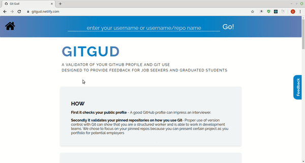

# GitGud

[CHECK THE APP](https://gitgud.netlify.com/)  
A validator of your GitHub profile and usage, designed to provide feedback for job seekers.  

## Table of contents:

- **[How](#how)**
- **[Why](#why)**
- **[Who](#who)**
- **[Technologies](#technologies)**
- **[Next steps to continue this project](#next-steps-to-continue-this-project)**

## How

1. It checks your public profile - A good GitHub profile can impress an interviewer.
2. It validates your pinned repositories on how you use Git - Proper use of version control with Git can show that you are a structured worker and are able to work in development teams. We chose to focus on your pinned repos because you can present certain project as your portfolio for potential employers
3. It is possible to go to individual repositories and look at their ratings, this can be done by typing githubname/reponame in the form.
4. It is also possible to search for multiple public profiles and create a group with the users and their scores.
5. It supports searching for previously created groups.

## Why

- You can use GitHub as your resume for job hunting. For developers it is important to code regularly, be able to work in teams, communicate properly and continue with a learning curve. Obviously this is something you can say you are the best in and write it on your resume, but with GitHub you are able to show that you can do this. Which will give you headsup on your next interview.
- Unfortunately many recent graduates or job seekers lack a proper GitHub profile. And as Codaisseur teachers can acknowledge, the feedback they get is repetitive. Therefore we developed this tool and provide constructive feedback which is based on various resources across the internet and uses live data from the GitHub API.

## Who

- **Oleksandra Akulshyna** - _Initial work_ - [w3bgir1](https://github.com/w3bgir1)
- **Vincent de Graaf** - _Initial work_ - [vdegraaf](https://github.com/vdegraaf)
- **Natalia Volchatova** - _Initial work_ - [Klackky](https://github.com/Klackky)
- **Demmy Honore de Vries** [demmyhonore](https://github.com/demmyhonore)
- **Mario Nezmah** - _Repository page_ - [mnezmah](https://github.com/mnezmah)
- **Jelle Monen** [jelle89](https://github.com/jelle89)
- **Subash Pradhan** [SubashPradhan](https://github.com/SubashPradhan)
- **Duc Trinh** [Ducatrinh](https://github.com/ducatrinh)
- **Halyna Burdiian** [Verdie](https://github.com/verdie)
- **Shawn Wu** [Mqspx800](https://github.com/Mqspx800)
- **Olga Lokoshchenko** [loklock](https://github.com/loklock)
- **Andreea Cucos** [andreeaccss](https://github.com/AndreeaCcss)

## Technologies

- Frontend - React, ApolloClient  

## Next steps to continue this project

- Make app responsive (adjust for other displays).
- We encourage to display the returned languages data with a pie chart in the Git Use block.
- Extra feature: Feedback on the commit usage of individuals when there is multiple contributors on the project.
- Improve feedback when creating a group
- Provide matching information in the markdown files

## How to setup

- CD into client folder
- Run npm install & npm run start

## Acknowledgments

Special thanks to Rein op 't Land, our teacher and Product Owner.

- **Rein op 't Land** - [ReinoptLand](https://github.com/Reinoptland)
